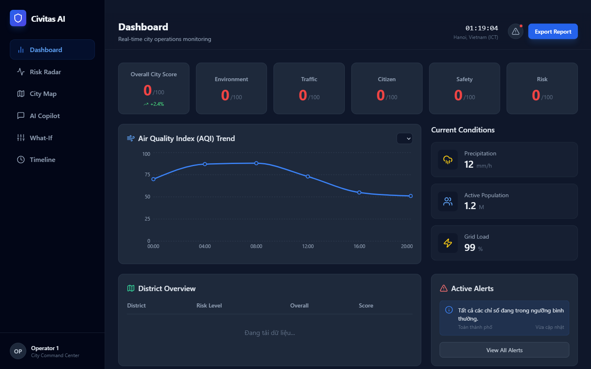
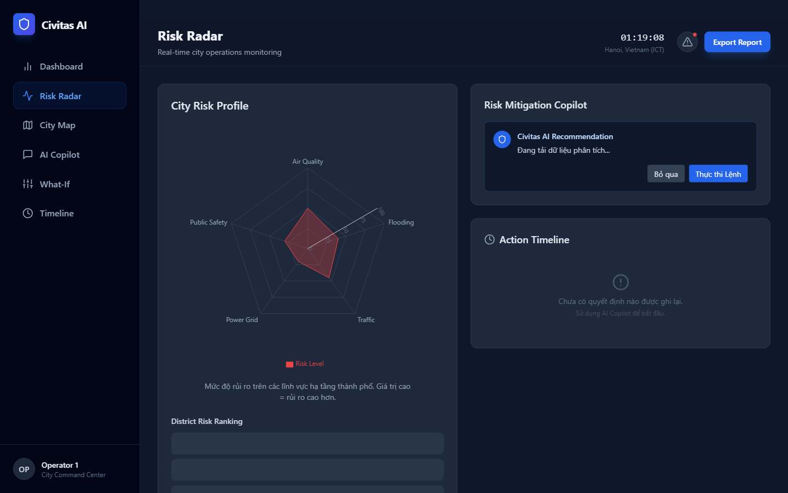
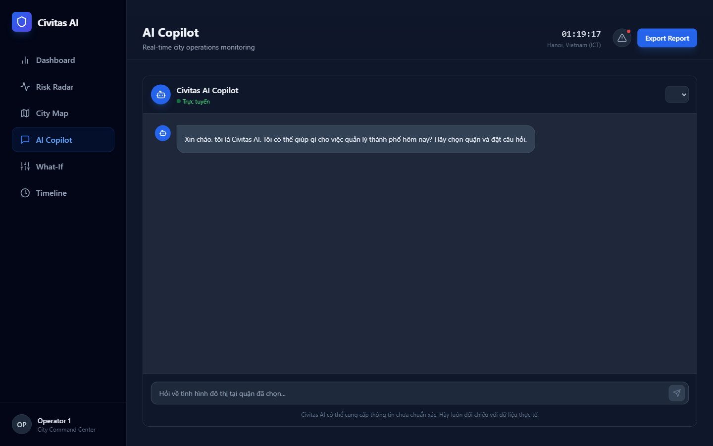
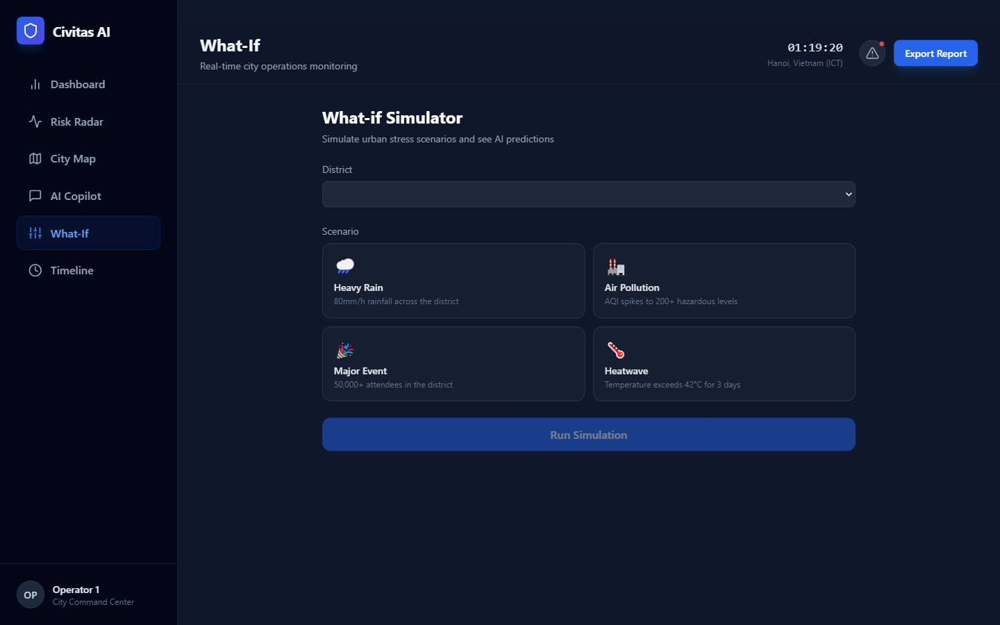

<div align="center">



# Civitas AI

**AI-powered Urban Operating System for Hanoi**

An intelligent city management platform that ingests real-time weather and air quality data, processes it through a multi-agent LangGraph pipeline powered by Google Gemini, and delivers actionable insights to city operators through a modern React dashboard.

[](https://python.org)
[](https://fastapi.tiangolo.com)
[](https://react.dev)
[](https://typescriptlang.org)
[](https://langchain-ai.github.io/langgraph/)
[](LICENSE)

[Features](#features) · [Screenshots](#screenshots) · [Quick Start](#quick-start) · [Architecture](#architecture) · [API Reference](#api-reference) · [Development](#development)

</div>

---

## Features

- **Real-time monitoring** — Weather and AQI data fetched every 15 minutes from Open-Meteo and OpenAQ across all 12 Hanoi districts
- **Multi-agent AI pipeline** — 6-node LangGraph graph (traffic → environment → event → citizen → decision → explanation) powered by Google Gemini
- **Live dashboard** — Score gauges, AQI trend charts, district overview table, and auto-generated alerts
- **Interactive map** — MapLibre GL dark map with color-coded district markers and detailed score panels
- **Risk Radar** — Recharts radar chart across 5 risk dimensions with AI-generated mitigation recommendations
- **AI Copilot** — Real-time chat interface that runs the full agent pipeline and returns structured decisions
- **What-If Simulator** — Scenario testing (heavy rain, air pollution, major event, heatwave) with AI predictions
- **Decision Timeline** — Persistent log of all agent decisions with confidence scores

---

## Screenshots

<table>
  <tr>
    <td width="50%">
      
      <p align="center"><b>Dashboard</b> — City scores, AQI trend, district table</p>
    </td>
    <td width="50%">
      
      <p align="center"><b>Risk Radar</b> — Multi-dimension risk chart + AI recommendation</p>
    </td>
  </tr>
  <tr>
    <td width="50%">
      
      <p align="center"><b>AI Copilot</b> — Real-time chat with agent pipeline</p>
    </td>
    <td width="50%">
      
      <p align="center"><b>What-If Simulator</b> — Urban stress scenario testing</p>
    </td>
  </tr>
</table>

---

## Tech Stack

| Layer | Technology |
|---|---|
| **Frontend** | React 18, TypeScript 5.5, Vite, Tailwind CSS, Recharts, MapLibre GL, TanStack Query, Axios |
| **Backend** | FastAPI 0.111, Python 3.11+, SQLAlchemy 2.0 (async), Pydantic v2 |
| **AI / Agents** | LangGraph 0.2, LangChain Google Gemini, Google Generative AI |
| **Database** | PostgreSQL 15, ChromaDB (vector store) |
| **Scheduler** | APScheduler — triggers full pipeline every 15 minutes |
| **Data Sources** | [Open-Meteo](https://open-meteo.com) (weather), [OpenAQ](https://openaq.org) (air quality) |
| **Infrastructure** | Docker Compose, Adminer |

---

## Architecture

```
┌─────────────────────────────────────────────────────────────────┐
│                      React Frontend (:3000)                      │
│   Dashboard · Map · Risk Radar · Copilot · Simulator · Timeline  │
└────────────────────────────┬────────────────────────────────────┘
                             │  /api/*  (Vite proxy)
┌────────────────────────────▼────────────────────────────────────┐
│                    FastAPI Backend (:8000)                        │
│                                                                  │
│  GET /api/districts      GET /api/scores/:id                     │
│  GET /api/aqi/history    GET /api/timeline                       │
│  POST /api/chat          POST /api/simulate                      │
└───────┬───────────────────────────────┬────────────────────────┘
        │                               │
┌───────▼───────────┐     ┌─────────────▼──────────────────────────┐
│    PostgreSQL      │     │          LangGraph Pipeline             │
│                   │     │                                         │
│  districts        │     │  ┌──────────┐    ┌───────────────────┐ │
│  weather          │◄────┤  │ AgentState│───►│ traffic_node      │ │
│  aqi              │     │  │           │    │ environment_node  │ │
│  city_score       │     │  │ weather   │    │ event_node        │ │
│  agent_decisions  │     │  │ aqi       │    │ citizen_node      │ │
└───────────────────┘     │  │ events    │    │ decision_node     │ │
        ▲                 │  │ feedback  │    │ explanation_node  │ │
        │                 │  └──────────┘    └───────────────────┘ │
┌───────┴───────────────┐ │            Google Gemini via LangChain  │
│  APScheduler (15 min) │ └────────────────────────────────────────┘
│                       │
│  WeatherPipeline      │  Open-Meteo API ──► weather per district
│  AQIPipeline          │  OpenAQ API    ──► aqi per district
│  FeedbackPipeline     │
│  CityScoreService     │  Derives: traffic · environment · risk · overall
└───────────────────────┘
```

### Agent Pipeline

Each `/api/chat` and `/api/simulate` request compiles and runs a stateful LangGraph graph:

```
traffic_node ──► environment_node ──► event_node ──► citizen_node ──► decision_node ──► explanation_node
```

Every node reads the shared `AgentState` TypedDict (weather data, AQI data, events, citizen feedback) and writes its analysis back. `decision_node` synthesises all domain analyses into structured predictions, impact assessment, and prioritised recommendations. The result is saved to `agent_decisions` and returned to the caller.

---

## Quick Start

### Prerequisites

- [Docker](https://docs.docker.com/get-docker/) & Docker Compose v2
- A [Google Gemini API key](https://aistudio.google.com/app/apikey) (free tier works)

### Docker (recommended)

```bash
git clone https://github.com/kairus-dev/civitas-ai.git
cd civitas-ai

# Create root .env with your Gemini key
echo "GEMINI_API_KEY=your_key_here" > .env

# Start all services
docker-compose up
```

All services start automatically. PostgreSQL is initialised with the schema and 12 Hanoi districts on first boot.

| Service | URL | Description |
|---|---|---|
| **Frontend** | http://localhost:3000 | React dashboard |
| **Backend API** | http://localhost:8000 | FastAPI |
| **Swagger UI** | http://localhost:8000/docs | Interactive API docs |
| **Adminer** | http://localhost:8080 | Database browser |

---

## Development

### Backend

```bash
cd backend

# Copy and fill environment variables
cp .env.example .env

# Install dependencies
pip install -r requirements.txt

# Start API server (requires PostgreSQL + ChromaDB)
uvicorn src.main:app --reload --port 8000

# Start scheduler in a separate terminal (runs pipelines every 15 min)
python -m src.scheduler.main
```

> **Local dev without Docker:** Set `DATABASE_URL=sqlite+aiosqlite:///./civitas_dev.db` in `.env`. The app will auto-create tables and seed 12 districts on first start.

### Frontend

```bash
cd frontend
npm install
npm run dev        # dev server at http://localhost:3000
npm run build      # TypeScript check + production build
```

The Vite dev server proxies `/api/*` to `http://localhost:8000` automatically.

### Running Tests

```bash
cd backend

pytest                                           # all tests
pytest tests/test_health.py                      # single file
pytest tests/test_health.py::test_health_endpoint  # single test
```

Tests use an SQLite in-memory database via a `db_session` fixture that overrides the FastAPI `get_db` dependency — no external services required.

---

## API Reference

### Districts & Scores

```http
GET /api/districts
```
Returns all 12 Hanoi districts.

```http
GET /api/scores
GET /api/scores/{district_id}
```
Returns latest computed city scores. Scores are derived from the most recent weather and AQI readings:
- `traffic_score` — inversely proportional to AQI index
- `environment_score` — inversely proportional to PM2.5
- `risk_score` — function of rainfall and AQI
- `overall_score` — weighted average of all four dimensions

```http
GET /api/aqi/history/{district_id}?limit=24
```
Returns the last N AQI readings for a district, formatted as a time series for charting.

### AI Agent

```http
POST /api/chat
Content-Type: application/json

{
  "query": "Tình hình ngập lụt tại quận này?",
  "district_id": 3
}
```

```http
POST /api/simulate
Content-Type: application/json

{
  "scenario": "heavy_rain",
  "district_id": 3
}
```

Available scenarios: `heavy_rain` · `air_pollution` · `major_event` · `heatwave`

Both endpoints run the full 6-node LangGraph pipeline and return:

```json
{
  "prediction": {
    "next_6h_aqi_trend": "increasing",
    "flood_risk": "high",
    "traffic_disruption": "likely"
  },
  "impact": {
    "population_affected": "150,000 residents",
    "economic_impact": "high",
    "health_risk": "moderate"
  },
  "recommendations": [
    "Activate flood drainage systems",
    "Deploy traffic management at flood-prone intersections"
  ],
  "confidence": 85.0,
  "explanation": [
    "Traffic Analysis: HIGH traffic congestion risk due to heavy rain.",
    "Environment Analysis: ...",
    "Confidence: 85% based on 4 data streams"
  ]
}
```

### Timeline

```http
GET /api/timeline?limit=20
```
Returns recent agent decisions ordered by most recent, including the original query, full prediction, and confidence score.

---

## Environment Variables

| Variable | Required | Default | Description |
|---|---|---|---|
| `DATABASE_URL` | ✅ | — | Async SQLAlchemy URL. Use `postgresql+asyncpg://...` for production or `sqlite+aiosqlite:///./dev.db` for local dev |
| `GEMINI_API_KEY` | ✅ | `""` | Google Gemini API key — get one free at [aistudio.google.com](https://aistudio.google.com) |
| `CHROMADB_HOST` | ❌ | `localhost` | ChromaDB host |
| `CHROMADB_PORT` | ❌ | `8001` | ChromaDB port |

---

## Project Structure

```
civitas-ai/
│
├── backend/
│   ├── src/
│   │   ├── agents/              # LangGraph agent nodes
│   │   │   ├── base.py          # AgentState TypedDict
│   │   │   ├── traffic_agent.py
│   │   │   ├── environment_agent.py
│   │   │   ├── event_agent.py
│   │   │   ├── citizen_agent.py
│   │   │   ├── decision_agent.py
│   │   │   └── explanation_agent.py
│   │   ├── api/routes/          # FastAPI routers (one file per domain)
│   │   ├── orchestrator/
│   │   │   └── graph.py         # builds + runs LangGraph StateGraph
│   │   ├── pipelines/           # data ingestion from external APIs
│   │   ├── repositories/        # async SQLAlchemy query helpers
│   │   ├── services/
│   │   │   └── city_score_service.py
│   │   ├── scheduler/
│   │   │   └── main.py          # APScheduler entry point
│   │   ├── models/              # SQLAlchemy ORM models
│   │   ├── schemas/             # Pydantic v2 request/response schemas
│   │   └── utils/               # config (pydantic-settings), logger
│   ├── tests/                   # pytest async test suite
│   ├── .env.example
│   └── requirements.txt
│
├── frontend/
│   └── src/
│       ├── pages/
│       │   ├── DashboardPage.tsx
│       │   ├── MapPage.tsx          # MapLibre GL
│       │   ├── RiskRadarPage.tsx    # Recharts RadarChart
│       │   ├── CopilotPage.tsx      # AI chat interface
│       │   ├── SimulatorPage.tsx
│       │   └── TimelinePage.tsx
│       ├── components/              # ScoreGauge, DistrictCard, AlertBanner, DecisionPanel
│       ├── services/api.ts          # Axios client
│       └── types/index.ts           # shared TypeScript interfaces
│
├── docker/
│   └── postgres/init.sql        # schema DDL + 12 district seed data
├── docs/
│   └── screenshots/
├── docker-compose.yml
└── README.md
```

---

## Database Schema

Schema is auto-applied on Docker first-boot from `docker/postgres/init.sql`.

| Table | Description |
|---|---|
| `cities` | Top-level city record (`city_id = 'hanoi'`) |
| `districts` | 12 Hanoi districts with optional GeoJSON geometry |
| `weather` | Per-district timestamped readings: temperature, humidity, rain, wind speed |
| `aqi` | Per-district timestamped readings: PM2.5, PM10, CO, NO₂, AQI index |
| `events` | City events with impact level (used by event_agent) |
| `citizen_feedback` | Citizen reports with sentiment (used by citizen_agent) |
| `city_score` | Derived scores: traffic, environment, citizen, risk, overall |
| `agent_decisions` | Full LangGraph output: prediction, impact, recommendations, confidence, explanation |

All tables include a `city_id` column (default `'hanoi'`) to support future multi-city deployments.

---

## Roadmap

- [ ] Real-time WebSocket score updates (eliminate polling)
- [ ] GeoJSON district boundary overlays on the map
- [ ] Citizen feedback ingestion from a public-facing form
- [ ] Notification system (email / push) for high-risk events
- [ ] Multi-city support (extend beyond Hanoi)
- [ ] LLM-generated natural language alerts in Vietnamese

---

## License

[MIT](LICENSE) — built by [@kairus-dev](https://github.com/kairus-dev)
