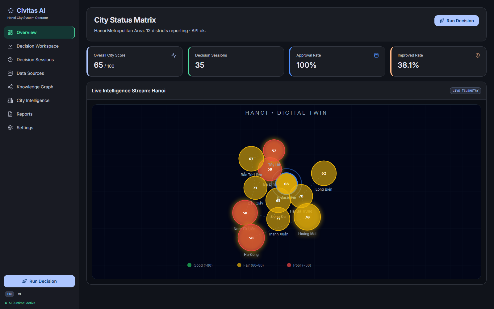
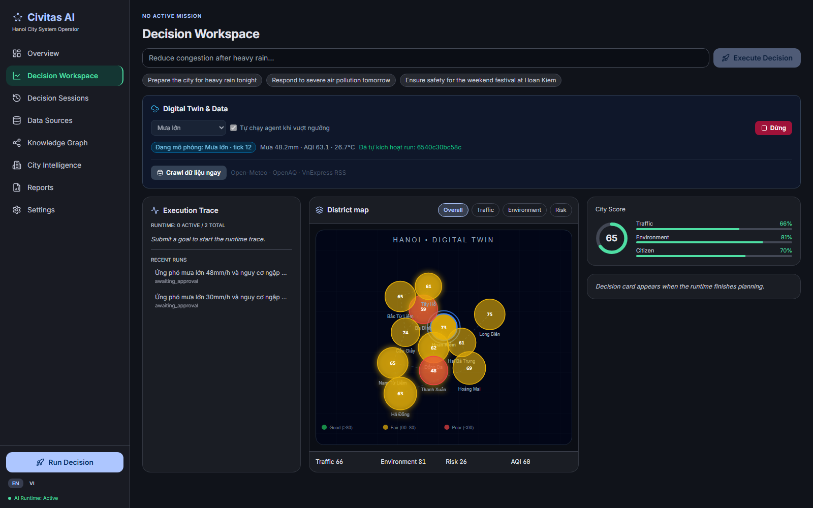
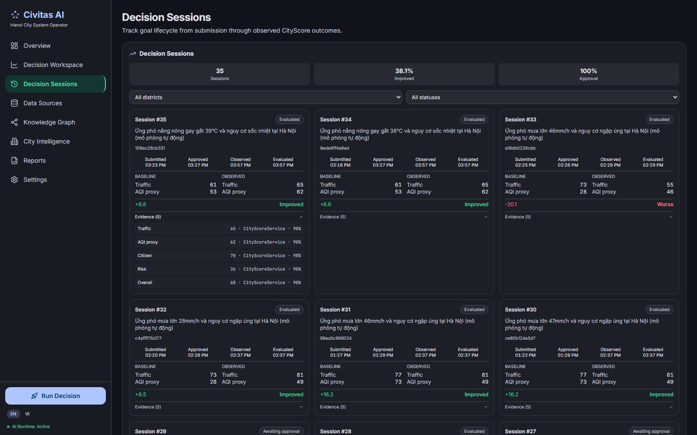
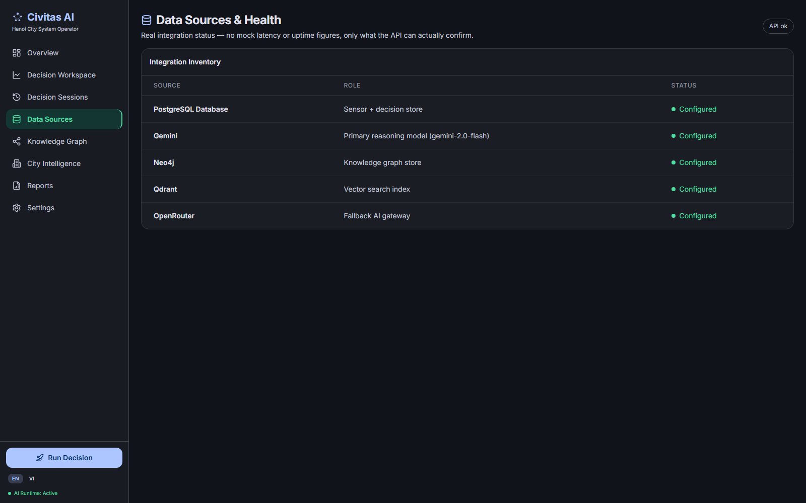
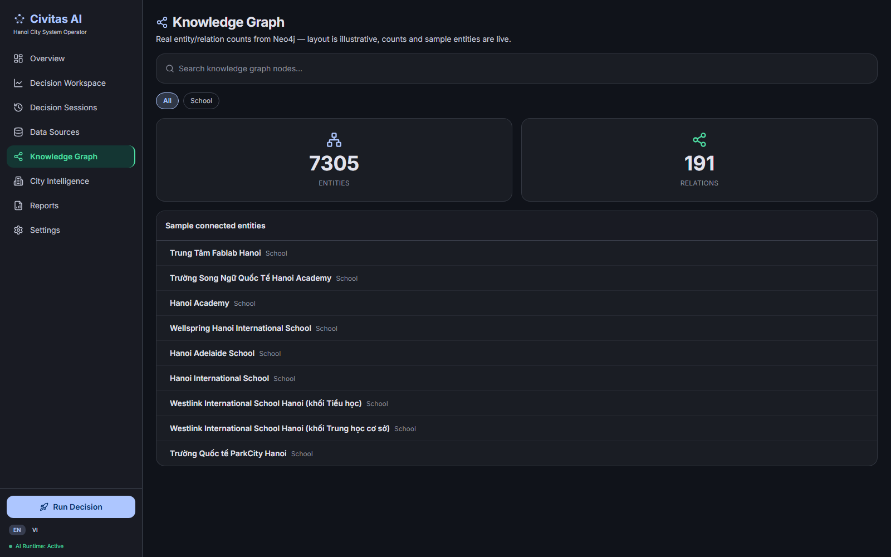
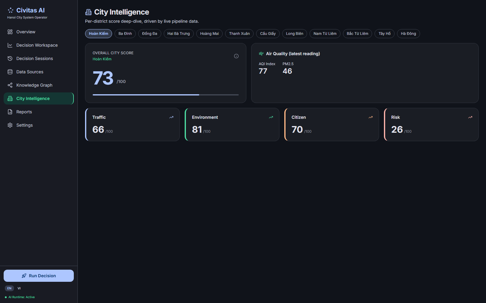
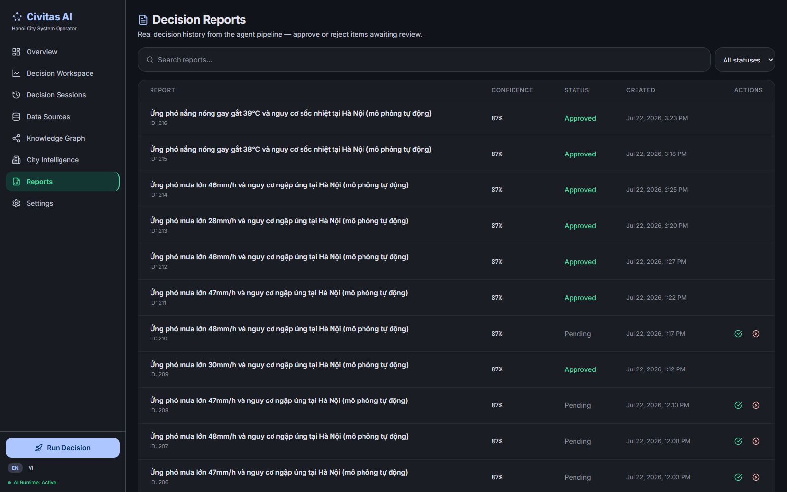
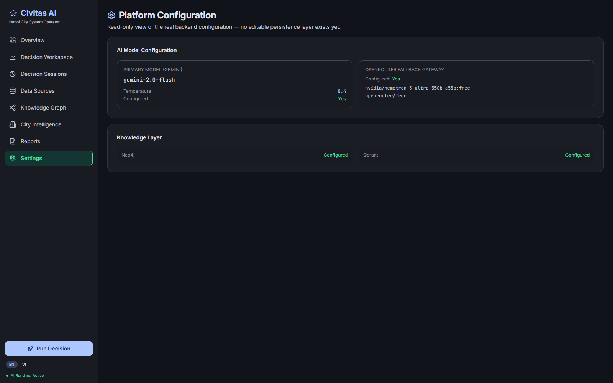

<div align="center">



# CityOS (Civitas AI)

**An Autonomous Multi-Agent Decision Intelligence Platform for Smart Cities**

CityOS ingests real-time weather, air quality, traffic, and citizen data, reasons over it with a goal-driven multi-agent runtime backed by a Neo4j + Qdrant knowledge graph and NVIDIA Nemotron models (via OpenRouter), and surfaces explainable, human-approved decisions through a Decision Workspace dashboard — real data only, in English or Vietnamese.

[](https://python.org)
[](https://fastapi.tiangolo.com)
[](https://react.dev)
[](https://typescriptlang.org)
[](https://neo4j.com)
[](https://qdrant.tech)
[](https://openrouter.ai/nvidia)
[](LICENSE)

[Demo](#demo) · [Features](#features) · [Architecture](#architecture) · [Tech Stack](#tech-stack) · [Quick Start](#quick-start) · [Screenshots](#screenshots) · [Roadmap](#roadmap)

</div>

---

## Demo

| |                                                                                                                                                                                                                    |
|---|--------------------------------------------------------------------------------------------------------------------------------------------------------------------------------------------------------------------|
| **Live deployment** | Frontend: [frontend-eta-six-46.vercel.app](https://frontend-eta-six-46.vercel.app) · Backend: [civitas-ai-backend.onrender.com](https://civitas-ai-backend.onrender.com)                                           |
| **Demo video** | `docs/demo/cityos_demo_recording.webm` — an unnarrated Playwright screen capture walking the live production app: Overview → language switch (EN/VI) → Decision Workspace (map metric toggle) → Decision Sessions → Data Sources → Knowledge Graph (search) → City Intelligence (district switch) → Reports (search + status filter) → Settings. Read-only against production — no goals submitted, nothing approved/rejected. |
| **Scenario shown** | Heavy rain triggers flash-flood risk in Hanoi → Planner dispatches Traffic + Emergency + Knowledge agents in parallel → Decision recommends road closures + shelter alerts → operator approves from Decision Workspace → Decision Session captures baseline CityScores and can **Check Outcome Now** |

---

## Features

- **Goal-driven multi-agent runtime (v2)** — a Planner decomposes a goal into a dependency-aware DAG; Traffic, Environment, Emergency, Citizen, and Knowledge workers execute in parallel waves, reflect on their own confidence, and feed a Decision stage that requires human approval
- **Decision Session lifecycle** — every v2 goal persists a `DecisionSession` (collecting → analyzing → recommend → awaiting_approval → observing → evaluated); at approval, a real `CityScoreService` baseline is captured; after a delay (or via **Check Outcome Now**) observed scores are compared and shown on the Decision Sessions page with KPI analytics
- **Evidence-backed decisions + Critic Agent** — every agent cites structured evidence (source, type, confidence, timestamp); the Critic reviews sufficiency and unsupported claims, and treats Knowledge **gap** evidence as a confidence penalty that can push a decision into human approval
- **Knowledge Quality Layer** — Qdrant chunks carry `ingested_at` freshness; Wikidata enrichment uses `enriched_by`/`enriched_at` without overwriting OSM provenance; Neo4j relationships store source/confidence/created_at; the Knowledge Agent emits gap evidence when nothing matched and surfaces real graph provenance in citations
- **Knowledge graph queries** — the Neo4j entity/relation graph is queried live: the Knowledge Agent extracts keywords, looks up related entities/relations (with edge metadata), and folds them into reasoning context and cited evidence
- **RAG knowledge layer** — OpenStreetMap, Wikipedia, Wikidata, GeoJSON boundaries, and government PDFs are chunked, embedded, and indexed into **Neo4j** (entity graph) + **Qdrant** (vector search), retrieved via an embed → search → rerank pipeline
- **NVIDIA Nemotron AI Gateway** — planning, embedding, reranking, and content-safety all route through NVIDIA Nemotron models via **OpenRouter**, behind a single gateway so the backing model can change without touching any agent; falls back to Google Gemini automatically for resilience
- **Real-time monitoring** — Weather and AQI data fetched every 15 minutes from Open-Meteo and OpenAQ across all 12 Hanoi districts
- **8-agent v1 pipeline** — Sequential graph (traffic → environment → event → citizen → knowledge → decision → critic → explanation) powered by Google Gemini
- **Live WebSocket streaming** — Agent pipeline progress broadcast in real time; operators watch each step complete
- **Stitch UI shell — 8 pages, real data only** — Overview, Decision Workspace, Decision Sessions, Data Sources, Knowledge Graph, City Intelligence, Reports, Settings, all driven by real backend responses; empty/error states are shown honestly instead of filled with placeholder content
- **Decision Workspace** — goal input + preset prompts, a numbered Execution Trace timeline, an SVG district map with a live metric toggle (overall/traffic/environment/risk), a Digital Twin panel (continuous scenario simulation + manual data crawl), and a Decision card with Approve/Reject, confidence/risk/evidence tiles, and Critic/Reflection warnings
- **English / Vietnamese UI** — every page's static chrome (nav, headings, buttons, table headers, empty/error states) is translated; a switcher in the sidebar footer toggles instantly and persists the choice, defaulting to English
- **Human-in-the-loop** — Decisions with confidence < 75% or flood risk flagged as `high` require operator approval
- **Decision Timeline** — Persistent log of all agent decisions with confidence scores and full explanations

---

## Tech Stack

| Layer | Technology |
|---|---|
| **Frontend** | React 18, TypeScript 5.5, Vite, Tailwind CSS, TanStack Query, Axios |
| **Backend** | FastAPI 0.111, Python 3.11+, SQLAlchemy 2.0 (async), Pydantic v2 |
| **Multi-Agent Runtime** | Event-driven Planner → Scheduler → Workers → Reflection → Decision (`src/runtime/`), pub/sub over `event_bus.py` |
| **AI Gateway** | NVIDIA Nemotron (planner, embedding, reranker, content-safety) via **OpenRouter**, Google Gemini fallback (`src/ai/`) |
| **Knowledge Graph** | **Neo4j** (entity/relation graph), **Qdrant** (vector search + RAG rerank) |
| **Knowledge Sources** | OpenStreetMap, Wikipedia, Wikidata, GeoJSON, government PDFs (`src/knowledge_pipeline/`) |
| **Database** | PostgreSQL 15 (production via Neon.tech), SQLite (local dev) |
| **Scheduler** | APScheduler — 15-min data pipelines + one-shot Decision Session outcome jobs |
| **Data Sources** | [Open-Meteo](https://open-meteo.com) (weather), [OpenAQ](https://openaq.org) (air quality) |
| **Testing** | pytest + httpx (backend), Vitest + Testing Library (frontend), Playwright (E2E) |
| **CI/CD** | GitHub Actions → Render (backend) + Vercel (frontend) + Neon.tech (database) |

---

## Architecture

```
┌─────────────────────────────────────────────────────────────────┐
│                  React Frontend (:3000)                          │
│   Stitch shell: Overview · Decision Workspace · Sessions ·       │
│   Data Sources · Knowledge Graph · City Intel · Reports · Settings│
└────────────────────┬────────────────────────┬───────────────────┘
                     │  /api/* (Vite proxy)   │  /ws (WebSocket)
┌────────────────────▼────────────────────────▼───────────────────┐
│                    FastAPI Backend (:8000)                        │
│  GET /api/districts   GET /api/scores   GET /api/timeline        │
│  GET /api/decision-sessions   POST .../{id}/observe              │
│  POST /api/chat       POST /api/simulate                         │
│  POST /api/decisions/{id}/approve|reject                         │
└───────┬─────────────────────────────┬────────────────────────────┘
        │                             │
┌───────▼──────────┐    ┌─────────────▼───────────────────────────┐
│   PostgreSQL      │    │           Agent Pipeline                 │
│                  │    │                                          │
│  districts       │    │  traffic → environment → event           │
│  weather         │◄───┤  → citizen → knowledge → decision        │
│  aqi             │    │  → critic → explanation                  │
│  city_score      │    │                                          │
│  agent_decisions │    │  Each step broadcasts WebSocket events   │
│  decision_sessions│   │  Decisions + sessions saved to DB        │
└───────────────────┘   └──────────────────────────────────────────┘
        ▲
        │
┌───────┴──────────────┐
│  APScheduler (15min)  │
│  WeatherPipeline      │  ← Open-Meteo API
│  AQIPipeline          │  ← OpenAQ API
│  FeedbackPipeline     │  ← synthetic citizen reports
│  CityScoreService     │  ← derives scores from sensor data
│  DecisionSession jobs │  ← one-shot outcome observation after approval
└───────────────────────┘
```
### Agent Pipeline

Every `/api/chat` and `/api/simulate` call runs a sequential 8-step pipeline:

```
Traffic → Environment → Event → Citizen → Knowledge → Decision → Critic → Explanation
```

Each agent is a sync function called via `asyncio.to_thread()`. Between steps, WebSocket events are broadcast so the UI shows live progress. Traffic, Environment, Event, Citizen, and Knowledge each cite structured **evidence** (source, type, confidence, timestamp) alongside their analysis — the Knowledge Agent draws on a static SOP keyword index, Qdrant `city_knowledge` chunks (with `ingested_at` freshness), *and* live Neo4j lookups that carry relationship provenance. When nothing matches, Knowledge emits a `type: "gap"` evidence item. The Decision Agent synthesises all analyses + evidence into a structured response. The Critic Agent (`src/reasoning/critic.py`, shared with the v2 runtime) then checks evidence sufficiency — including knowledge gaps — reducing confidence when it finds problems. If the resulting `confidence < 75` or `flood_risk == "high"`, the decision is flagged as `requires_approval = True`.

### CityOS v2 Runtime — Multi-Agent + RAG (`backend/src/runtime/`, `src/ai/`)

```
                              User Goal
                                  │
                            Planner (DAG)
                                  │
                 ┌────────────────┼────────────────┐
                 ▼                ▼                ▼
          Traffic Worker   Emergency Worker   Knowledge Worker
                 │                │                │
                 └────────────────┼────────────────┘
                                  ▼
                            Reflection
                     (confidence check, re-dispatch)
                                  │
                                  ▼
                              Decision
                       (requires human approval)
                                  │
                                  ▼
                              Workflow
                    + DecisionSession (baseline → observe)

     Knowledge Worker retrieval path:
       Query → Embedding → Qdrant (top 20) → Nemotron Rerank → top 5 → context
       Query → keyword extraction → Neo4j find_related() → graph facts → context
       (gap evidence when SOP + chunks + graph facts are all empty)

     Decision → Critic (src/reasoning/critic.py, shared with v1) checks evidence
       sufficiency, unsupported claims, and knowledge gaps before human approval

     AI Gateway (backend/src/ai/gateway.py) — single choke point:
       Planner / Embedding / Reranker / Content-Safety
                          │
                 NVIDIA Nemotron (via OpenRouter)
                          │
              (falls back to Google Gemini on failure)

     Knowledge Graph + Quality Layer:
       OSM + Wikipedia + Wikidata + GeoJSON + Gov PDFs
                          │
       Neo4j (entities/relations + edge source/confidence/created_at)
       Qdrant (vectors + ingested_at freshness)
```

Every event (`plan_created`, `worker_started`, `reflection`, `decision_ready`, `approval_needed`, ...) is published on an async `event_bus.py` and bridged to the frontend as `runtime_event` over the same WebSocket used by the v1 pipeline, driving the live Execution Trace in Decision Workspace.

### Score Derivation

`CityScoreService` derives scores from the latest sensor readings per district:

| Score | Formula |
|---|---|
| `traffic_score` | `100 − (aqi_index / 3)` |
| `environment_score` | `100 − (pm25 / 1.5)` |
| `risk_score` | `(rain × 5) + (aqi_index / 4)` |
| `overall_score` | mean of traffic, environment, citizen, `(100 − risk)` |

---

## Quick Start

### Prerequisites

- [Docker](https://docs.docker.com/get-docker/) & Docker Compose v2
- A [Google Gemini API key](https://aistudio.google.com/app/apikey) (free tier works)

### Docker (recommended)

```bash
git clone https://github.com/kairus-dev/civitas-ai.git
cd civitas-ai

echo "GEMINI_API_KEY=your_key_here" > .env
docker-compose up
```

All services start automatically. PostgreSQL is initialised with the schema and 12 Hanoi districts on first boot.

| Service | URL | Description |
|---|---|---|
| **Frontend** | http://localhost:3000 | React Stitch shell (Overview, Decision Workspace, etc.) |
| **Backend API** | http://localhost:8000 | FastAPI |
| **Swagger UI** | http://localhost:8000/docs | Interactive API docs |
| **Adminer** | http://localhost:8080 | Database browser |

### Local dev (without Docker)

**Backend:**
```bash
cd backend
cp .env.example .env
# Set DATABASE_URL=sqlite+aiosqlite:///./civitas_dev.db  (tables auto-created)
pip install -r requirements.txt
uvicorn src.main:app --reload --port 8000

# Scheduler (separate terminal — runs pipelines every 15 min)
python -m src.scheduler.main
```

**Frontend:**
```bash
cd frontend
npm install
npm run dev     # http://localhost:3000 — proxies /api/* to :8000
```

---

## API Reference

### Districts & Scores

```http
GET /api/districts
```
Returns all 12 Hanoi districts.

```http
GET /api/scores
GET /api/scores/{district_id}
```
Returns latest computed city scores per district.

```http
GET /api/aqi/history/{district_id}?limit=24
```
Returns last N AQI readings for charting.

### AI Agent (v1 — backend-only, no frontend caller)

`/api/chat` and `/api/simulate` power the original v1 sequential pipeline. They're still fully implemented and backend-tested, but the frontend now uses the v2 runtime exclusively (Decision Workspace → `/api/v2/goal`) — call these directly (curl/Swagger) to exercise the v1 path.

```http
POST /api/chat
Content-Type: application/json

{ "query": "Tình hình ngập lụt tại quận này?", "district_id": 3 }
```

```http
POST /api/simulate
Content-Type: application/json

{ "scenario": "heavy_rain", "district_id": 3 }
```

Available scenarios: `heavy_rain` · `air_pollution` · `major_event` · `heatwave`

Both endpoints run the full 8-agent pipeline and return:

```json
{
  "prediction": {
    "next_6h_aqi_trend": "increasing",
    "flood_risk": "high",
    "traffic_disruption": "likely"
  },
  "impact": {
    "population_affected": "150,000 residents",
    "economic_impact": "high",
    "health_risk": "moderate"
  },
  "recommendations": [
    "Activate flood drainage systems",
    "Deploy traffic management at flood-prone intersections"
  ],
  "confidence": 85.0,
  "explanation": [
    "Traffic Analysis: HIGH traffic congestion risk due to heavy rain.",
    "Knowledge: Flood Emergency SOP triggered — activate drainage pumps...",
    "Confidence: 85% based on 4 data streams"
  ],
  "evidence": [
    {
      "id": "ev-1",
      "agent": "traffic",
      "source": "Open-Meteo",
      "type": "sensor",
      "content": "Rain 45.0mm/h driving congestion risk",
      "confidence": 0.9,
      "time": "2026-07-21T08:00:00Z"
    },
    {
      "id": "ev-4",
      "agent": "knowledge",
      "source": "SOP",
      "type": "sop",
      "content": "Flood Emergency SOP: Activate drainage pumps at all low-lying districts.",
      "confidence": 0.9,
      "time": "static"
    }
  ]
}
```

`evidence` is grouped by agent (source, type, confidence, timestamp) — inspect it directly from the JSON response since there is no v1 frontend viewer; the v2 Decision Workspace shows its own evidence count on each decision's Evidence tile instead.

### Human-in-the-loop

```http
POST /api/decisions/{id}/approve
POST /api/decisions/{id}/reject
```

Approving or rejecting a decision broadcasts a `approval_result` WebSocket event to all connected clients. On the v2 runtime path, approval also captures a Decision Session baseline and schedules outcome observation.

### Decision Sessions (v2)

```http
GET /api/decision-sessions
GET /api/decision-sessions?status=observing
GET /api/decision-sessions/analytics
GET /api/decision-sessions/{id}
POST /api/decision-sessions/{id}/observe
```

List/detail return persisted session lifecycle records (baseline vs observed CityScores, outcome status, evidence). `POST .../observe` is the demo **Check Outcome Now** path — runs the same outcome logic as the scheduled job when the session is in `observing` status (409 otherwise). Analytics returns approval/improved rates and average decision latency.

### Timeline

```http
GET /api/timeline?limit=20
```
Returns recent agent decisions ordered by most recent.

### WebSocket

Connect at `ws://localhost:8000/ws`. Events:

| `type` | When |
|---|---|
| `pipeline_start` | Before first agent |
| `agent_update` | Before/after each agent (`status: running\|done`) |
| `pipeline_done` | After decision saved |
| `approval_needed` | When `requires_approval = true` |
| `approval_result` | After approve/reject |

---

## Environment Variables

| Variable | Required | Default | Description |
|---|---|---|---|
| `DATABASE_URL` | ✅ | — | `postgresql+asyncpg://...` for prod, `sqlite+aiosqlite:///./dev.db` for local |
| `GEMINI_API_KEY` | ✅ | `""` | Get a free key at [aistudio.google.com](https://aistudio.google.com) |
| `OPENROUTER_API_KEY` | ❌ | `""` | Enables the AI Gateway — NVIDIA Nemotron planning/embedding/rerank/safety, and the Gemini-quota fallback path. Every AI Gateway function degrades to `None`/passthrough when unset |
| `OPENROUTER_TIMEOUT_SECONDS` | ❌ | `10.0` | Per-request timeout for OpenRouter calls |
| `NEO4J_URI` / `NEO4J_USER` / `NEO4J_PASSWORD` | ❌ | `""` | Enables the knowledge graph (entity/relation storage + live `find_related()` queries) and decision-chain memory. Falls back to in-memory/no-op behavior when unset |
| `QDRANT_URL` / `QDRANT_API_KEY` | ❌ | `""` | Enables the `city_knowledge` vector collection and SOP semantic search. Falls back to static keyword search when unset |
| `CHROMADB_HOST` / `CHROMADB_PORT` | ❌ | `localhost` / `8001` | Declared in config but unused — superseded by Qdrant. Safe to leave unset |

---

## Testing

Three automated test layers totalling **505** tests (369 backend + 110 frontend unit + 26 E2E).

### Backend (pytest)

```bash
cd backend
pytest                          # all 369 tests
pytest -v tests/test_health.py  # single file
```

Uses SQLite in-memory — no external services required. See [docs/TESTING.md](docs/TESTING.md) for full details.

### Frontend unit (Vitest)

```bash
cd frontend
npm test            # 110 tests, single pass
npm run test:watch  # watch mode
```

### E2E (Playwright)

```bash
cd frontend
npm run e2e          # 26 tests across suites 05-08, Chromium headless
npm run e2e:headed   # watch the browser
npm run e2e:ui       # interactive UI explorer
```

Suites 06 and 07 mock all API calls and run without a backend. Suite 05 is a full-stack integration test that auto-skips if the backend is unreachable. Suite 08 is a read-only smoke test against the live production deployment.

---

## Project Structure

```
civitas-ai/
├── .github/workflows/
│   ├── ci.yml              # tests on every push/PR (4 parallel jobs)
│   └── deploy.yml          # deploy to Render + Vercel on main push
│
├── backend/
│   ├── src/
│   │   ├── agents/         # 8 agent node functions (sync, called via asyncio.to_thread)
│   │   ├── reasoning/
│   │   │   └── critic.py   # shared critic (evidence sufficiency, unsupported claims, knowledge gaps)
│   │   ├── runtime/        # v2 event-driven runtime: planner, scheduler, workers, reflection, decision, workflow, event_bus, memory
│   │   ├── ai/              # AI Gateway: gateway.py (OpenRouter/Nemotron choke point), planner, embedding, reranker, safety
│   │   ├── knowledge_pipeline/  # RAG ingestion + quality metadata (ingested_at, Wikidata enriched_by, Neo4j edge props)
│   │   ├── simulation/     # v2 Digital Twin: continuous scenario-driven synthetic data engine + auto-goal trigger
│   │   ├── api/routes/     # districts, scores, chat, simulator, decisions, decision_sessions, timeline, aqi, runtime, simulation_v2, ws
│   │   ├── orchestrator/
│   │   │   └── graph.py    # sequential pipeline runner + WebSocket broadcasting
│   │   ├── pipelines/      # WeatherPipeline, AQIPipeline, FeedbackPipeline
│   │   ├── repositories/   # async SQLAlchemy query helpers
│   │   ├── services/       # CityScoreService, DecisionSessionService
│   │   ├── scheduler/      # APScheduler entry + shared registry (decision observe jobs)
│   │   ├── models/         # SQLAlchemy ORM models (incl. DecisionSession)
│   │   ├── schemas/        # Pydantic v2 schemas
│   │   ├── ws/             # WebSocket connection manager
│   │   └── utils/          # pydantic-settings config, logger
│   ├── scripts/
│   │   ├── migrate_neon.py        # one-time Neon.tech migration + district seed
│   │   └── verify_openrouter.py   # manual live-verification of OpenRouter model slugs
│   ├── tests/              # 322 async pytest tests
│   ├── Dockerfile.prod     # production Docker image (2 Uvicorn workers)
│   └── requirements.txt
│
├── frontend/
│   ├── src/
│   │   ├── pages/stitch/               # 8 Stitch shell pages (Overview, Decision Workspace, Decision Sessions, Data Sources, Knowledge Graph, City Intelligence, Reports, Settings)
│   │   ├── layout/AppShell.tsx         # sidebar + <Outlet /> shell, logo lockup, EN/VI switcher
│   │   ├── components/
│   │   │   ├── HanoiMap.tsx            # SVG district map with click handlers + metric toggle
│   │   │   ├── LogoMark.tsx            # network-node SVG logo (sidebar + favicon source)
│   │   │   ├── DecisionSessionsPanel.tsx # session KPI tiles, timeline, Check Outcome Now
│   │   │   └── SimulationPanel.tsx     # v2 Digital Twin controls + crawl trigger (mounted in Decision Workspace)
│   │   ├── i18n/                       # en.ts/vi.ts dictionaries, LanguageContext, useTranslation hook
│   │   ├── hooks/useWebSocket.ts       # auto-reconnecting WebSocket hook
│   │   ├── services/api.ts             # Axios client
│   │   └── types/index.ts             # shared TypeScript interfaces
│   ├── e2e/                            # Playwright suites 05-08
│   ├── playwright.config.ts
│   └── vercel.json                     # SPA rewrite + build config
│
├── render.yaml             # Render Blueprint for backend service
├── docker-compose.yml      # local full-stack dev
└── docs/
    ├── DEPLOYMENT.md       # step-by-step Neon + Render + Vercel setup
    ├── TESTING.md          # test layer details + data-testid reference
    └── superpowers/        # design specs + implementation plans
```

---

## Database Schema

| Table | Description |
|---|---|
| `districts` | 12 Hanoi districts with optional geometry |
| `weather` | Per-district readings: temperature, humidity, rain, wind speed |
| `aqi` | Per-district readings: PM2.5, PM10, CO, NO₂, AQI index |
| `events` | City events with impact level |
| `citizen_feedback` | Citizen reports with sentiment |
| `city_score` | Derived scores: traffic, environment, citizen, risk, overall |
| `agent_decisions` | Full pipeline output: prediction, impact, recommendations, confidence, explanation, approval status |
| `decision_sessions` | v2 goal lifecycle: baseline/observed CityScores, outcome status, context snapshot, outcome evidence |

All tables carry a `city_id` column (default `'hanoi'`) for future multi-city support (`decision_sessions` scopes by `district_id` + `run_id` instead).

---

## Screenshots

*Live captures from the deployed app ([frontend-eta-six-46.vercel.app](https://frontend-eta-six-46.vercel.app)), all 8 Stitch pages.*

| Overview | Decision Workspace |
|---|---|
|  |  |

| Decision Sessions | Data Sources |
|---|---|
|  |  |

| Knowledge Graph | City Intelligence |
|---|---|
|  |  |

| Reports | Settings |
|---|---|
|  |  |

---

## Deployment

Production stack: **Neon.tech** (PostgreSQL) + **Render** (backend) + **Vercel** (frontend), orchestrated by GitHub Actions.

Quick setup overview:

1. **Neon.tech** — Create project → copy connection string → run `python -m scripts.migrate_neon`
2. **Render** — New Web Service → Docker → set `DATABASE_URL` + `GEMINI_API_KEY` → copy deploy hook URL
3. **Vercel** — `vercel link` in `frontend/` → set `VITE_API_BASE_URL` + `VITE_WS_URL` → get token/IDs
4. **GitHub Secrets** — Add `RENDER_DEPLOY_HOOK_URL`, `VERCEL_TOKEN`, `VERCEL_ORG_ID`, `VERCEL_PROJECT_ID`

See [docs/DEPLOYMENT.md](docs/DEPLOYMENT.md) for the complete step-by-step guide.

---

## Roadmap

### Knowledge Pipeline

**v1 (bootstrap)** — one-shot ingestion via `python -m src.knowledge_pipeline.bootstrap`:
- ✅ OpenStreetMap (hospitals, schools, police, fire stations, roads, bus stops, parks, rivers, buildings)
- ✅ Wikipedia (8 topics: Hanoi, Flood, Natural disaster, Transportation, Public health, Air pollution, Climate change, Emergency management)
- ✅ GeoJSON district boundaries (derived from OSM admin boundaries)
- ✅ Wikidata (best-effort enrichment of OSM entities)
- ✅ Government PDF (fully functional, ships with an empty `config/pdf_sources.yaml` — add entries to activate)
- ✅ Neo4j city entity graph + Qdrant `city_knowledge` collection

**v2 (shipped)**:
- ✅ `scheduler.py`: weekly automated Wikipedia refresh, registered on the same APScheduler instance the 15-min pipelines use (gated behind a configured Gemini or OpenRouter key)
- ✅ `Neo4jLoader.find_related()`: the knowledge graph is no longer write-only — the Knowledge Agent queries it live for entities/relations matching keywords in the user's question
- ✅ Knowledge Quality Layer: Qdrant `ingested_at`, Wikidata `enriched_by`/`enriched_at`, Neo4j relationship source/confidence/created_at, Knowledge gap evidence, Critic gap penalty (backend-verified; no dedicated frontend gap-badge viewer since the v1 evidence UI was retired — inspect via `/api/chat`'s `evidence` array)

**v2.1–v2.3 (planned — not in current scope)**:
- Knowledge Acquisition (external search / crawler to resolve gaps)
- Multi-source Consensus / conflict detection
- Autonomous Knowledge Evolution closed-loop with Decision Session outcomes

**v3 (planned)**:
- Incremental updates, RSS/news source integration, automated PDF discovery
- Streaming ingestion (Kafka or equivalent), real-time knowledge updates

### Vision

- **Digital Twin** — full 3D city model synced to live sensor + agent state
- **Drone & IoT integration** — live aerial feeds and sensor networks as first-class agent inputs
- **NVIDIA NIM** — self-hosted Nemotron microservices for latency-sensitive/offline deployments, drop-in via the existing AI Gateway
- **Omniverse** — physics-based simulation for testing agent decisions against synthetic disaster scenarios before they reach production
- **Robotics** — dispatching autonomous ground/aerial units as an executable output of the Decision stage, not just a recommendation

---

## AI Gateway (`backend/src/ai/`)

Centralizes all OpenRouter/Nemotron calls behind one gateway so no agent talks to the network directly:

- `gateway.py` — `call_openrouter(models, payload, endpoint)`: tries each model in a fallback list, returns the first successful response or `None`.
- `safety.py` — `check_safety(text)`: content-safety check, fails **open** (`safe=True`) if the gateway is unreachable.
- `embedding.py` — `embed(text)`: standalone embedding call (not wired into the existing Gemini-backed `city_knowledge`/`cityos_sop` Qdrant collections).
- `reranker.py` — `rerank(query, documents, top_k)`: reorders candidates, falls back to original order on failure.
- `planner.py` — `complete(prompt, context)`: safety-checked completion (pre- and post-check).

Wired into `KnowledgeMemory._qdrant_search` (`src/runtime/memory.py`) as an optional post-processing step: widens the Qdrant candidate set and reranks it before truncating to `k`.

**Gemini quota fallback:** `call_gemini()` (`src/agents/gemini_client.py`) — used by the Knowledge, Decision, and Explanation agents (Traffic/Environment/Event/Citizen/Critic are pure rule-based, no LLM call) and the knowledge pipeline's entity extractor — now falls back to `planner.complete()` (OpenRouter/Nemotron) whenever the Gemini call fails, e.g. on free-tier `429 RESOURCE_EXHAUSTED`. This runs automatically once `OPENROUTER_API_KEY` is set; unaffected (same as before) when unset.

**Model slugs — live-verified 2026-07-05:** the planner model was live-tested against the real OpenRouter API and found wrong (`nvidia/nemotron-3-ultra:free` → HTTP 400); fixed to `nvidia/nemotron-3-ultra-550b-a55b:free` (confirmed HTTP 200) in `src/ai/planner.py`. `openrouter/free` (fallback) confirmed to be a real OpenRouter free-model router. The `safety`/`embedding`/`reranker` model slugs were cross-checked against OpenRouter's public NVIDIA model catalog (all matched) but not live-tested end-to-end — do one live call per function before depending on them for a demo.

**Before demoing with a real `OPENROUTER_API_KEY`:** every module in this package is tested offline (mocked gateway) — no test proves the OpenRouter model slugs or `embeddings`/`rerank` endpoint paths actually resolve. A wrong slug degrades silently to `None`/passthrough with only a log warning. Manually call `complete()`, `embed()`, `rerank()`, and `check_safety()` once each against the real API before relying on this layer.

**Inactive by default.** Every function in this package degrades gracefully (`None`/passthrough, never raises) when `OPENROUTER_API_KEY` is unset in `.env` — existing Gemini-based agents and pipelines are unaffected. Set `OPENROUTER_API_KEY` to activate.

---

## License

[MIT](LICENSE) — built by [@kairuslabs](https://github.com/kairuxlabs)
